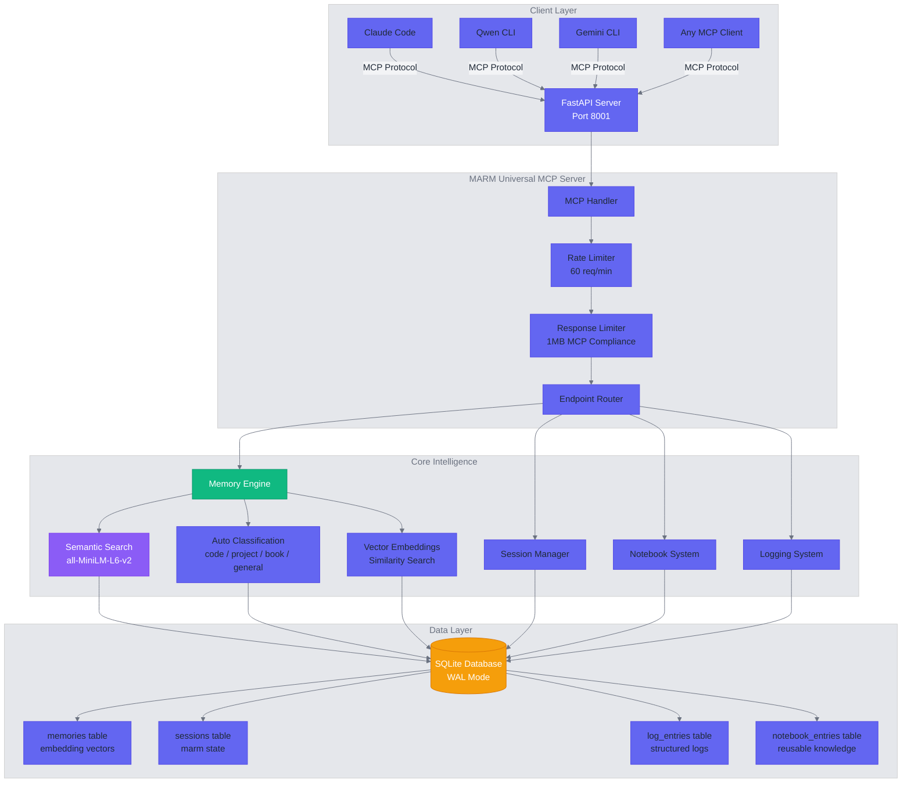
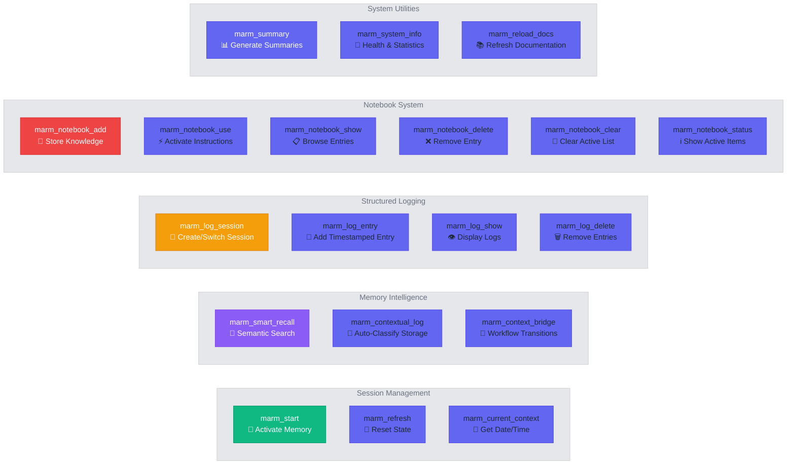
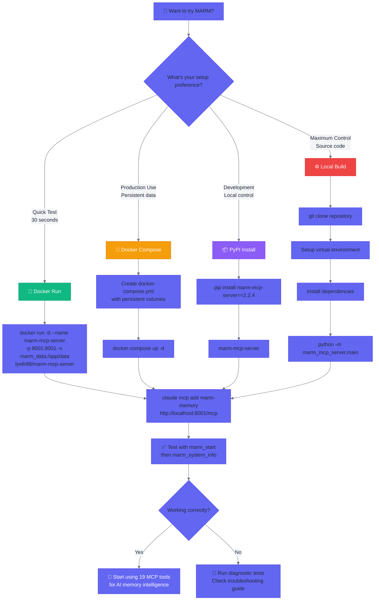

# MARM MCP Server - Visual Documentation

Modern Mermaid diagrams to help new users understand the MARM Universal MCP Server architecture and workflows.

---

## MARM Architecture Overview



---

## API Endpoints by Function



---

## Installation Decision Tree



---

## Memory Intelligence Workflow

```mermaid
%%{init: {'theme': 'base', 'themeVariables': {'primaryColor': '#6366f1', 'primaryTextColor': '#1f2937', 'primaryBorderColor': '#4f46e5', 'lineColor': '#6b7280', 'secondaryColor': '#f3f4f6', 'tertiaryColor': '#e5e7eb', 'background': '#ffffff', 'secondaryTextColor': '#374151', 'tertiaryTextColor': '#6b7280'}}}%%
graph TD
    subgraph "Input Processing"
        A[AI Agent Input<br/>Text/Code/Questions] --> B[Content Analysis]
        B --> C{Storage or Retrieval?}
    end

    subgraph "Storage Workflow"
        C -->|Store| D[marm_contextual_log<br/>Auto-Classify Content]
        D --> E[Generate Embeddings<br/>all-MiniLM-L6-v2]
        E --> F[Content Classification<br/>code | project | book | general]
        F --> G[Vector Storage<br/>SQLite + embeddings BLOB]
        G --> H[Session Association<br/>Link to current session]
    end

    subgraph "Retrieval Workflow"
        C -->|Retrieve| I[marm_smart_recall<br/>Semantic Query]
        I --> J[Query Embedding<br/>Convert to vectors]
        J --> K[Similarity Search<br/>Cosine similarity]
        K --> L[Ranking & Filtering<br/>Relevance scoring]
        L --> M[Context Assembly<br/>Prepare for AI agent]
    end

    subgraph "Intelligence Layer"
        N[Cross-Session Search<br/>search_all=True]
        O[Multi-AI Memory<br/>Claude + Qwen + Gemini]
        P[Context Bridging<br/>Workflow transitions]
        Q[Auto-Summarization<br/>Large context handling]
    end

    M --> N
    H --> O
    M --> P
    L --> Q

    subgraph "Output Delivery"
        R[Structured Response<br/>MCP 1MB compliance]
        S[Rate Limited<br/>60 req/min]
        T[Context-Aware Results<br/>Relevant memories]
    end

    N --> R
    O --> S
    P --> T
    Q --> T

    style D fill:#10b981,stroke:#059669,color:#ffffff
    style I fill:#8b5cf6,stroke:#7c3aed,color:#ffffff
    style E fill:#f59e0b,stroke:#d97706,color:#ffffff
    style K fill:#ef4444,stroke:#dc2626,color:#ffffff
    style R fill:#6366f1,stroke:#4f46e5,color:#ffffff
```

---

*Generated for MARM v2.2.4 - Universal MCP Server for AI Memory Intelligence*