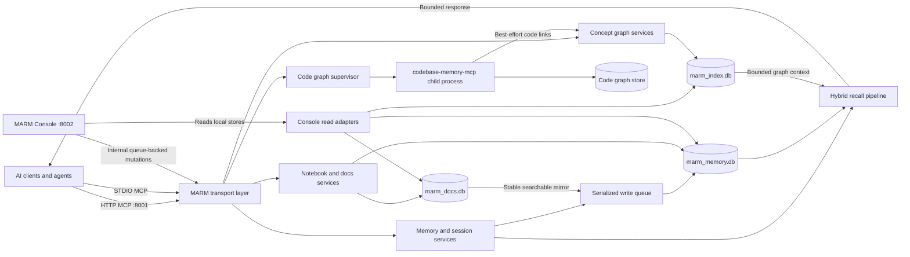

# MARM Technical Overview

> Current implementation: MARM MCP Server v2.28.1

This document explains what MARM is, why it is built this way, and how information moves through the system from an agent writing something to that information being recalled later. It is intended as a technical product overview, not a source-code reference.

## What MARM Is

MARM is a local-first memory and knowledge layer for AI agents. It runs as a Model Context Protocol (MCP) server and gives compatible clients a shared place to:

- record session history and durable memories;
- retrieve exact technical details and meaning-based context;
- maintain reusable scratch notes and permanent documents;
- reduce repetitive memories through consolidation and reviewed compaction;
- build a concept graph from stored memories;
- index source repositories and answer structural code questions;
- share context across agents, clients, projects, and sessions.

The core problem is that an AI model's context window is temporary. A conversation may know what happened five minutes ago, but a new chat, another model, or another development tool does not. MARM places that state in a local service rather than relying on one model vendor's chat history.

MARM is designed around five practical requirements:

1. **Local ownership:** primary data stays in local SQLite databases and graph stores.
2. **Useful developer recall:** exact strings such as file paths and error codes matter as much as semantic similarity.
3. **Multi-agent safety:** concurrent readers should remain fast while writes are ordered safely.
4. **Bounded context:** retrieval must not flood an agent's context window or exceed MCP response limits.
5. **Optional intelligence:** embeddings and graphs add capability, but their failure must not take down basic memory.

## System Shape



The memory store is the authoritative recall layer. The permanent-doc store, concept graph, and code graph are isolated domains with different responsibilities. This prevents an experimental graph build or a large repository index from corrupting or blocking the primary memory database.

## Start-to-Finish Lifecycle

### 1. Server startup

MARM can run as a shared HTTP server or as a private STDIO child process. Both transports expose the same 14 MCP tools.

At startup, MARM:

1. loads environment settings and resolves local storage paths;
2. initializes the memory database using additive, idempotent schema migrations;
3. creates a small SQLite connection pool and enables WAL mode;
4. checks whether stored embedding dimensions match the configured model;
5. registers lifecycle and automation handlers;
6. starts the serialized memory-write worker;
7. restores the previously active session;
8. optionally starts the compaction scheduler;
9. begins serving MCP requests.

The embedding model is not loaded during normal startup. The code graph is also not started. Both are lazy so basic logging, exact recall, notebooks, and summaries remain available with a small startup cost.

### 2. An agent records information

The most common ingestion path is `marm_log_entry`. It performs two related writes:

- a structured record goes into `log_entries` for chronological session history;
- a semantic copy goes into `memories` so normal recall can find the content later.

Failure of the semantic copy does not discard the structured log. This is deliberate: durable capture is more important than optional enrichment.

A memory write then follows this flow:

1. **Sanitize and classify:** content is normalized and assigned a context type when one was not supplied.
2. **Attach scope:** session is required; project and platform attribution are attached when available.
3. **Queue the write:** the request waits in a bounded async queue and is handled by one worker.
4. **Optional consolidation:** exact duplicates can be removed and strong semantic duplicates can be merged when consolidation is enabled.
5. **Create the embedding:** the Jina encoder is loaded on first semantic use and produces a 512-dimensional vector. If encoding fails, the memory is still stored.
6. **Commit atomically:** the memory row and session timestamp are written inside a SQLite transaction.
7. **Update exact search:** SQLite triggers keep the FTS5 index synchronized with the memory row.
8. **Chunk long content:** larger memories are split and embedded in the `memory_chunks` sidecar table.
9. **Update maintenance state:** the session write counter can trigger a later compaction scan.

The queue orders mutations; it does not make reads wait. Agents can continue recalling while another agent is writing.

### 3. An agent recalls information

`marm_smart_recall` combines exact retrieval and semantic retrieval instead of assuming every query is the same kind of problem.

The recall pipeline is:

1. **Scope the search:** optional session, project, and platform filters narrow the eligible memories.
2. **Detect exact-shaped queries:** configuration keys, CLI flags, paths, URLs, API names, quoted strings, and similar syntax can use deterministic exact retrieval.
3. **FTS5 candidate search:** SQLite BM25 finds a bounded set of lexical candidates quickly.
4. **Semantic reranking:** the query is embedded and candidates are scored in one NumPy batch using cosine similarity.
5. **Bounded fallback:** if FTS coverage is weak or malformed, MARM can scan a capped set of embeddings rather than the entire store without limit.
6. **Chunk-aware scoring:** when a memory has chunk embeddings, its best matching chunk represents the parent memory. Results still contain one row per memory.
7. **Temporal weighting:** recency provides a conservative boost after relevance scoring.
8. **Optional graph enrichment:** related concepts, relationships, and linked code symbols are attached as a `graph_context` sidecar. Primary memory ranking stays authoritative.
9. **Response shaping:** `detail=1/2/3` controls returned depth, duplicates are removed, and the response is kept below MCP's 1 MB limit.

If semantic search is unavailable, exact and FTS-based retrieval can still operate. If the concept graph is unavailable, memory results return without graph context.

### 4. Information is maintained over time

MARM has three separate cleanup layers:

- **Exact consolidation:** normalized SHA-256 content hashes detect duplicate writes within scope.
- **Semantic consolidation:** optional write-time similarity can merge near-duplicate memories.
- **Compaction:** optional background analysis finds clusters of older related memories and proposes a summary.

Compaction is intentionally staged rather than silently destructive:

```text
detect candidates -> generate/stage summary -> review -> apply or discard
```

When a summary is applied, the operation runs through the same write queue and inside one explicit transaction. The source rows are retained and marked as sources, the summary records their IDs, and the staging row becomes applied. MARM rechecks expiry, session ownership, content hashes, and project/platform scope immediately before commit so stale work cannot overwrite newer information.

## Storage and Database Plumbing

### Primary memory database

Default path: `~/.marm/marm_memory.db`

This is the production-critical store. Important tables include:

| Table | Responsibility |
|---|---|
| `memories` | Recallable content, embeddings, hashes, scope, timestamps, and compaction lineage |
| `memories_fts` | External-content FTS5 index maintained by insert/update/delete triggers |
| `memory_chunks` | Embeddings for sections of long memories and promoted documents |
| `sessions` | Session identity, activity, and last-accessed state |
| `log_entries` | Structured chronological session history |
| `notebook_entries` | Session-scoped scratchpad entries |
| `compaction_staging` | Reviewable compaction candidates and summaries |
| `compaction_session_state` | Per-session write counters used by compaction |
| `session_summary_cache` | Cached paste-ready session summaries |
| `doc_index` | Hash tracking for MARM's packaged documentation |
| `user_settings` | Small durable server settings and state |

SQLite connections use WAL mode, `synchronous=NORMAL`, foreign keys, an in-memory temporary store, and a small connection pool. WAL allows readers to continue while a writer commits. MARM still uses one serialized application-level writer because SQLite ultimately permits only one active writer at a time.

Multi-statement mutations use explicit `BEGIN IMMEDIATE`, `COMMIT`, and rollback handling where atomicity matters. This avoids partial operations such as creating a log entry without its session update or applying half of a compaction.

### Permanent documents database

Default path: `~/.marm/docs/marm_docs.db`

Notebook entries are temporary, session-scoped scratch notes and are retrieved by exact name. They do not carry embeddings. `marm_notebook(action="save")` copies a scratch entry or inline content into the permanent docs database.

The durable document is then mirrored into the memory database through the write queue. The mirror has a stable memory ID, uses `context_type="doc"`, and participates in semantic recall, chunking, compaction, and concept extraction. If mirror synchronization fails, the permanent document remains saved and reports a pending mirror state that a later save can repair.

### Concept graph database

Default path: `~/.marm/index/marm_index.db`

This database stores extracted entities, typed relationships, source-memory provenance, duplicate candidates, code-symbol links, schema metadata, and durable concept-build runs. It has its own connection pool and never shares memory-database connections.

### Code graph store

Default directory: `~/.marm/graph/`

The code graph is owned by the pinned `codebase-memory-mcp` engine. It is not stored in the memory or concept databases. MARM supervises the engine as a child process and communicates over newline-delimited JSON-RPC through STDIO.

### Local operational analytics

MARM records basic startup, shutdown, and usage events in a local SQLite analytics file. The current tracker writes locally and is best-effort; analytics failure does not affect MCP operations.

## Embeddings and Chunking

MARM uses fastembed with `jinaai/jina-embeddings-v2-small-en`:

- 512 output dimensions;
- 8,192-token model window;
- lazy local ONNX execution;
- one shared encoder protected by a lock;
- float32 byte storage in SQLite;
- batch cosine scoring through NumPy.

Chunking prevents the meaning of a long memory from being diluted into one vector.

| Content | Chunk threshold | Target size | Overlap |
|---|---:|---:|---:|
| Normal memory | 500 words | 250 words | 50 words |
| Permanent document mirror | 1,000 words | 800 words | 100 words |

The chunker distributes remainder text across chunks instead of creating a tiny trailing fragment. Chunk rows are unique by `(memory_id, chunk_index)`, making repeated document saves idempotent.

Existing installations that still contain 384-dimensional MiniLM embeddings must run `marm-memory maintenance embeddings migrate` while MARM processes are stopped. Mixed dimensions are detected and skipped rather than being interpreted incorrectly.

## Knowledge Graphs

MARM contains two graph systems because they answer different questions.

### Concept graph: what the memory means

`marm_concept_build` reads stored memories and extracts entities and typed relationships. Entities retain session, project, platform, and source-memory provenance. Relationships can represent ideas such as `implements`, `depends_on`, `uses`, `causes`, or `related_to`.

Concept builds are explicit and bounded. The default build cap is 500 memory rows, and build progress is persisted so Console can report queued, running, success, degraded, or failed states. Extraction uses the spaCy runtime and English model bundled with the package, loaded lazily on first build; if that runtime cannot initialize, the tools remain registered and normal recall is unaffected.

`marm_concept_recall` provides explicit graph traversal with bounded depth and direction. `marm_smart_recall` also uses the graph automatically as an additive sidecar. A concept graph can be backed up and rebuilt because it is derived from authoritative memories.

### Code graph: how the project is structured

The code graph indexes local repositories into files, symbols, calls, imports, and other structural relationships. MARM exposes five focused tools over the larger upstream engine:

- repository indexing and status;
- symbol, text, and source lookup;
- call and data-flow tracing;
- architecture summaries;
- change-impact analysis.

The graph engine starts only on the first code-graph request. A local pip installation may download its binary on first use; Docker builds can bake it into the image. MARM pins and verifies the upstream tool contract before use, serializes each request/response round trip, drains subprocess logs, detects crashes, and can restart the child on a later call.

If the code graph fails, its tools return an unavailable response while all core memory and concept-memory behavior continues. Concept-to-code links are best-effort and only appear when the corresponding project has been indexed.

## Public Tool Surface

HTTP and STDIO expose the same 14 MCP tools.

| Area | Tools | Purpose |
|---|---|---|
| Memory | `marm_smart_recall` | Exact, semantic, chunk-aware, and graph-enriched recall |
| Logging | `marm_log_entry`, `marm_log_show`, `marm_delete` | Capture, browse, and remove structured session history and notebook paths |
| Reuse | `marm_notebook`, `marm_summary` | Scratchpad/permanent docs and cached session handoff summaries |
| Maintenance | `marm_compaction` | Candidate detection, staging, review, apply, and discard |
| Code graph | `marm_graph_index`, `marm_code_lookup`, `marm_graph_trace`, `marm_graph_architecture`, `marm_graph_impact` | Repository indexing and structural code intelligence |
| Concept graph | `marm_concept_build`, `marm_concept_recall` | Memory-side entity extraction and relationship traversal |

MARM Console has additional internal REST routes for human administration. Memory create, replace, and delete operations still delegate to MARM's queue-backed mutation paths. These routes are intentionally not public MCP tools.

## Supporting Runtime Automation

Several background behaviors keep the agent-facing tool surface smaller than the system behind it:

- **Protocol delivery:** the first successful tool call for a session can carry the MARM operating protocol, teaching the connected agent how to use memory without exposing another setup tool.
- **Self-indexed product documentation:** packaged MARM docs are loaded lazily into the reserved `marm_system` namespace. `doc_index` hashes prevent unchanged files from being rewritten, and a background refresh check runs every 50 tool calls.
- **Cached handoffs:** `marm_summary` formats session log history into a paste-ready handoff and caches the result. Log mutations mark the cache dirty so it rebuilds only when needed.
- **Project and platform attribution:** MARM derives project from the working directory and platform from the client environment when possible. Explicit environment or tool parameters can override detection.
- **Health and readiness:** public health endpoints allow clients, containers, and Console to distinguish a live HTTP process from an MCP tool failure.
- **Graceful shutdown:** MARM stops the compaction scheduler, drains the write queue, closes the graph child process, and records local shutdown state before exiting.

## Transport, Security, and Multi-Agent Behavior

### HTTP

The FastAPI server listens on `127.0.0.1:8001` by default and mounts MCP at `/mcp`. Loopback use requires no key. Once the server is network-exposed, protected routes require `Authorization: Bearer <MARM_API_KEY>`.

HTTP requests pass through authentication, IP-based rate limiting, protocol tracking, Pydantic validation, and response limiting. Forwarded client-IP headers are trusted only when the direct connection comes from a local trusted proxy.

Default rate limiting is 80 requests per minute per IP. CLI presets raise this for shared agent swarms or disable it for explicitly trusted private deployments. Rate limits protect the HTTP surface; the write queue independently protects SQLite ordering.

### STDIO

STDIO runs as a private child process launched by an MCP client. It does not require an API key and writes protocol output only to STDOUT while operational logs go to STDERR. Its wrappers call the same service logic as HTTP so transport behavior stays aligned.

### MARM Console

MARM Console is the bundled local human interface launched with `marm-memory console`. Its packaged FastAPI host defaults to `127.0.0.1:8002` and serves the production frontend without Node. Contributors can still run the separate FastAPI and React/Vite development servers during active development. Console can inspect memory, sessions, logs, notebooks, compaction, concept graphs, and indexed projects.

Console protects `/api/*` with the same loopback-or-bearer policy as the MCP runtime and validates Host headers. Set `MARM_CONSOLE_ALLOWED_HOSTS` to a comma-separated allowlist when intentionally exposing Console under additional hostnames or LAN addresses.

## Failure and Safety Model

MARM treats the memory database as the critical path and everything else as progressively optional.

| Failure | Expected behavior |
|---|---|
| Embedding model unavailable | Store the memory without an embedding; exact/FTS behavior remains available |
| Semantic mirror of a log fails | Keep the structured log entry and report no memory ID |
| Permanent-doc mirror fails | Keep the durable doc and report mirror synchronization as pending |
| Concept extraction unavailable | Keep core tools working and return degraded/empty concept results |
| Concept graph missing or stale | Return normal ranked memories without graph enrichment |
| Code graph cannot start or crashes | Return graph unavailable; do not affect memory tools |
| Compaction sources change or expire | Mark the candidate stale rather than applying an unsafe summary |
| Response approaches 1 MB | Trim graph detail and memory content while reporting truncation |
| Queue reaches capacity | Apply backpressure instead of creating concurrent SQLite writers |

This fail-open structure is central to MARM: optional intelligence may disappear temporarily, but the system should continue capturing and retrieving primary memory.

## Current Boundaries

MARM is currently optimized for many agents sharing one local server and one SQLite-backed data directory. It is not a distributed database and does not provide multi-node replication or hosted cloud synchronization.

Other deliberate boundaries:

- one application process should own a memory database at a time;
- code repositories must be re-indexed after meaningful source changes;
- concept builds are explicit rather than running on every memory write;
- consolidation and compaction are opt-in maintenance features;
- concept extraction loads its bundled model lazily on first build;
- MARM Console shares the managed runtime's authenticated API and packaged lifecycle.

Within those boundaries, the architecture is intentionally modular: the primary memory path remains small and dependable, while semantic retrieval, permanent docs, compaction, concept knowledge, code intelligence, and the human Console add capability around it without becoming single points of failure.
